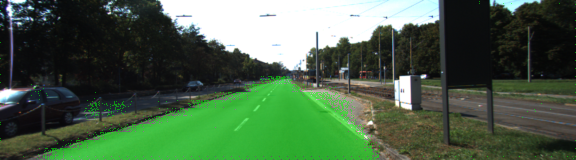
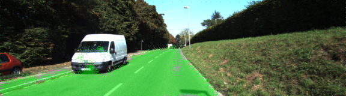
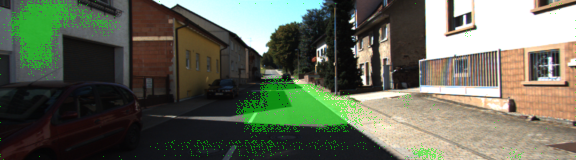

# Semantic Segmentation

This repo contains an implementation of the [FCN-8 neural network architecture](https://people.eecs.berkeley.edu/~jonlong/long_shelhamer_fcn.pdf) to label road pixels in images.

## Training and performance

The model in `main.py` was trained over 30 epochs with a batch size of 10 images, which reduced the average loss to approximately `0.18`.

Some sample output on the test images is shown below.  Also the model can be applied to video frames as demonstrated [here](video/test_video_processed.mp4).

The model often mis-classifies pixels when the lighting conditions vary significantly from the training data.  Possible approaches to mitigate this could include:
* Pre-processing images to improve their quality before applying the labelling algorithm; and/or
* Augmenting the training data by including images with artificially reduced/increased brightness.

